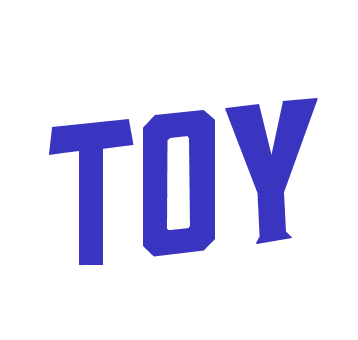
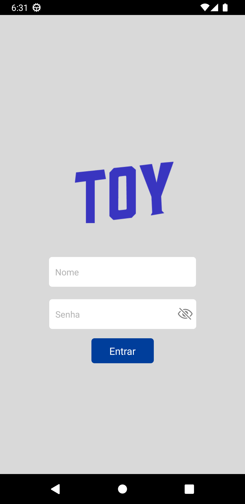
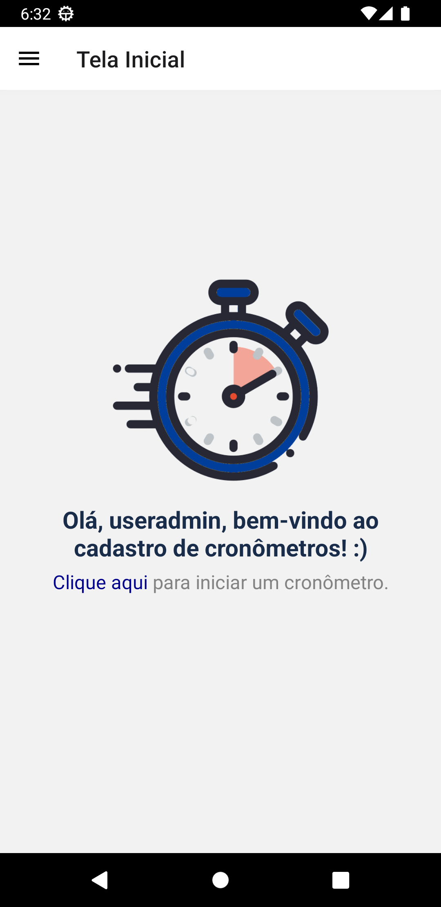
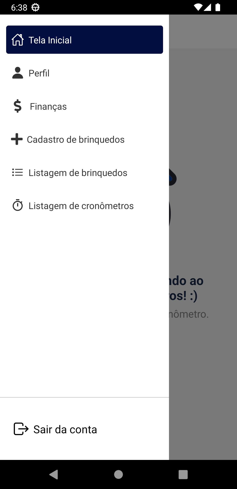
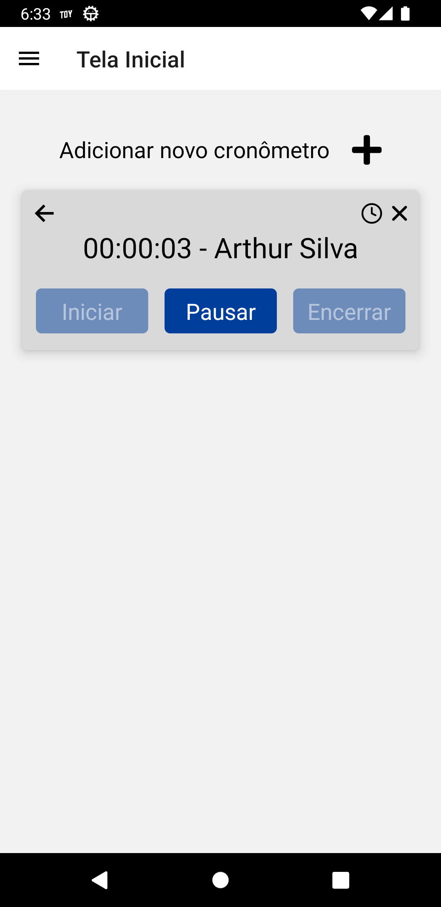
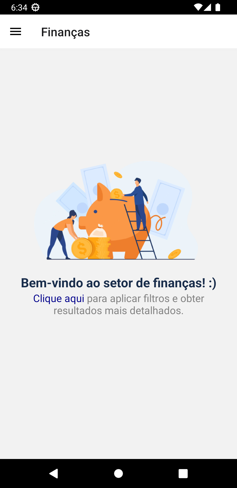
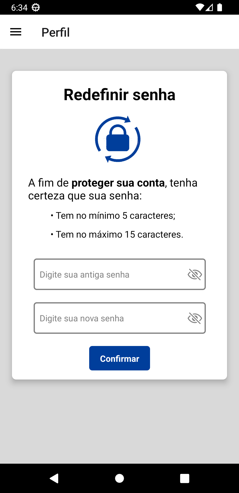

# AppToy

  

> App desenvolvido em React Native voltado para o controle/fluxo de clientes nos brinquedos de um parque. Com uma interface intuitiva, os operadores podem facilmente registrar a entrada e saída dos clientes em cada brinquedo, além de ter dados sobre o lucro diário, semanal e mensal.

## 💻 Tecnologias utilizadas

### Ferramentas usadas durante o desenvolvimento da aplicação:

- 

- 

- 

- 

- 

- 

- 

## 📲 Funcionalidades

### Principais funcionalidades presentes na aplicação:

- Login/Logout do proprietário dos brinquedos;
- Possibilidade de redefinição de senha para o proprietário do brinquedo;
- Cronômetro para controlar o tempo gasto de cada cliente em um brinquedo;
- Cadastro, edição, listagem e remoção de brinquedos;
- Listagem e remoção do tempo passado por cada cliente;
- A seção de "Finanças" é dedicada aos proprietários de brinquedos para o acompanhamento detalhado dos lucros obtidos. Aqui, poderá ser visualizado os ganhos diários, semanais e mensais com facilidade.

## 🎨 Telas da aplicação

### A seguir, alguns prints da UI da aplicação:

 

## 🤝 Colaboradores

### Responsável pelo desenvolvimento do projeto:

<table>
  <tr>
    <td align="center">
      <a href="#">
        
         
        
          <b>Desenvolvedor Front-end: Arthur Silva</b>
        
      </a>
    </td>
  </tr>
</table>

##
